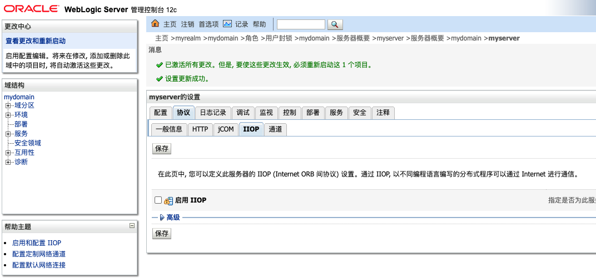

# CVE-2023-21839：WebLogic 远程代码执行漏洞通告

报告来源：长亭科技

更新日期：2023-01-18

## 0x01  漏洞简述

Oracle 官方在 1 月 18 日发布了重要补丁更新 CPU （Critical Patch Update），修复了存在于 Oracle WebLogic Server 中的多个高危漏洞：

https://www.oracle.com/security-alerts/cpujan2023.html

## 0x02  漏洞详情

在这次补丁修复的漏洞里，CVE-2023-21839 为 WebLogic Server T3 / IIOP 协议中的高危漏洞，攻击者可在远程且未经授权的状态下通过 T3 或者 IIOP 协议交互利用此漏洞进行 JNDI 注入利用攻击，从而可在服务端执行任意恶意代码，获取系统权限。

## 0x03  影响版本

受到 CVE-2023-21839 漏洞影响的 Weblogic Server 版本包括:

- 12.2.1.3.0
- 12.2.1.4.0
- 14.1.1.0.0

## 0x04  修复建议

使用 Oracle 官方安全补丁进行更新修复：

https://www.oracle.com/security-alerts/cpujan2023.html

由于 WebLogic 基于 T3、IIOP 协议利用的反序列化漏洞层出不穷，用户可在确认不影响业务的情况下可以考虑配置 WebLogic 对外部禁用 T3、IIOP 协议。

**配置 WebLogic 对外部禁用 T3 协议的具体步骤：**

登入 WebLogic 控制台，在对应域设置中选择 “安全” - “筛选器” 选项卡：


在 “连接筛选器” 输入框中输入：

```
weblogic.security.net.ConnectionFilterImpl
```

在 “连接筛选器规则” 输入框中输入（即配置为仅允许本机使用 T3/T3S 协议通信，禁用除本机以外其他主机使用 T3/T3S 协议通信）：

```
127.0.0.1 * * allow t3 t3s
0.0.0.0/0 * * deny t3 t3s
```

输入后保存提交即可。

**配置 WebLogic 禁用 IIOP 协议的具体步骤：**

登入 WebLogic 控制台，在对应域设置中选择 “环境” - “服务器”，并选中要设置的服务器。然后在对应服务器设置中选择 “协议” - “IIOP” 选项卡，并取消 “启用IIOP” 前面的勾选：



保存后，重启服务器使设置生效。

## 0x06 Poc（for reference only）

- https://github.com/4ra1n/CVE-2023-21839
- https://github.com/DXask88MA/Weblogic-CVE-2023-21839
- https://github.com/dream0x01/weblogic-framework
- https://github.com/Firebasky/CVE-2023-21839
