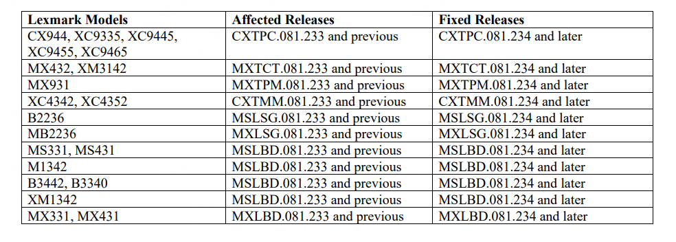
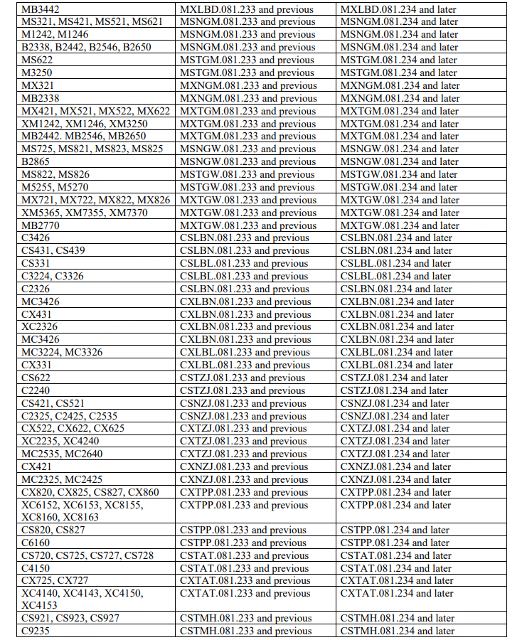
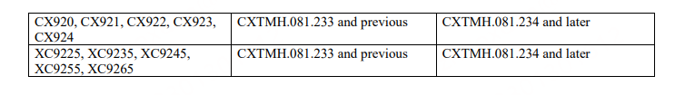

# CVE-2023-23560：Lexmark打印机服务器端请求伪造漏洞通告

报告编号：B6-2023-013002

更新日期：2023-01-30

## 0x01  漏洞简述

2023年01月30日，360CERT监测发现`Lexmark官方`发布了`Lexmark打印机`的风险通告，漏洞编号为`CVE-2023-23560`，漏洞等级：`高危`，漏洞评分：`9.0`。该漏洞的`PoC`和`EXP`已公开。

利盟(Lexmark)是一家美国公司，为激光打印机的开发及生产商，以及内容管理软件的提供商，主要服务对象为商业用户，其打印机在全球范围内被广泛使用。

## 0x02  风险等级

该漏洞的评定结果如下

| 评定方式    | 等级 |
| ----------- | ---- |
| 威胁等级    | 高危 |
| 影响面      | 一般 |
| 攻击者价值  | 高   |
| 利用难度    | 低   |
| 360CERT评分 | 9.0  |

## 0x03  漏洞详情

### CVE-2023-23560: Lexmark打印机服务器端请求伪造漏洞

CVE: CVE-2023-23560

组件: Lexmark

漏洞类型: 服务器端请求伪造

影响: 代码执行

简述: 该漏洞存在于Lexmark打印机中，是一个服务器端请求伪造 (SSRF) 漏洞。该漏洞是由 Web 服务功能中的输入验证不当引起的。远程攻击者可利用此漏洞进行SSRF攻击，进而在系统上执行任意代码。

## 0x04  影响版本

## 0x05  修复建议

### 通用修补建议

根据`影响版本`中的信息，排查并升级到`安全版本`。

下载链接：https://support.lexmark.com/en_us.html